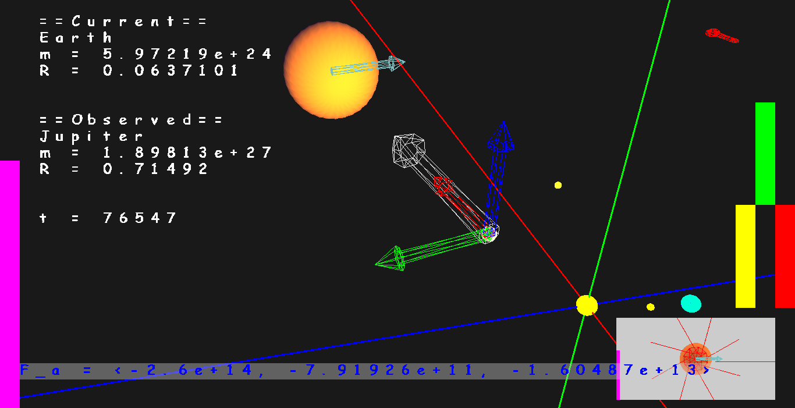

# PlaneteSimulator
A simulation of the main planets in the solar system.

*Uses Forward Euler to simulate planetary motion
*Can be used to visualize Apparent Retrograde Motion

Checkout those Clips and see a demonstration: https://youtu.be/pe5Ooj6hcBI https://youtu.be/G21DPYPPa8w 

Here is a screenshot just to make you excited about this:

# Additional Info
The Repository also stores some python programs that can be used to visualize what is happening in the 3D c++ application more clearly.

#P.S.
Just in case you can’t find the actual code: Look in the glGame2 folder. (That's for historic reasons, when I started to write this graphics engine I had planned to make an OpenGL based 2D game and called the project glGame2. Before I had time to start working on the gameplay, I came up with the Solar System Simulation thing and ditched my planes to make a Game entirely. I should have renamed the Project right away but this file path was and still is hardcoded in in so many places... It would be really tedious to change it).

#Documentation
This was manly my own little project, but in the end I did use it to get a good grade as well. I held a talk about some of the fundamentals of this program for some freshmen and sophomores majoring in mathematics and engineering. You can download my presentation [here](doc/Presentation/Solar%20System%20Simulator.pptx) (Don't be surprised though most slides aren't self-explanatory). I also wrote a [Paper](doc/PlaneteSimulatorDocumnetaion/PlaneteSimulatorDocumnetaion.pdf) about the mathematical background of my project (the math part starts on page 5).
